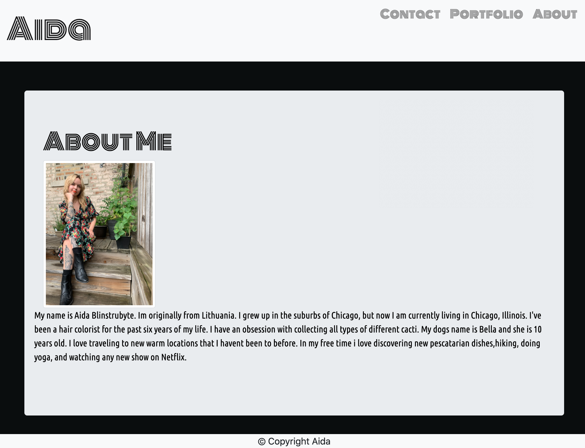
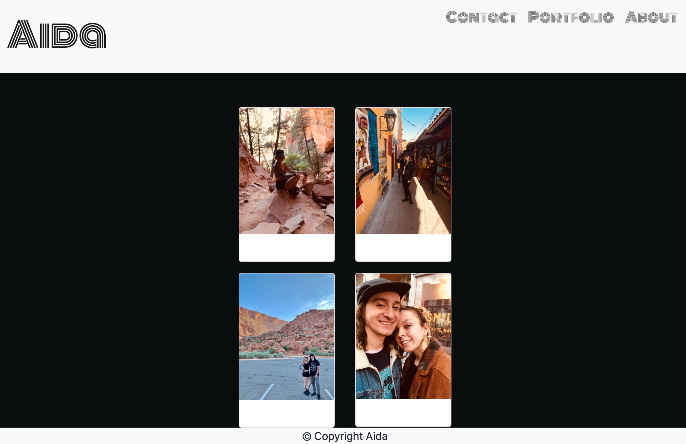
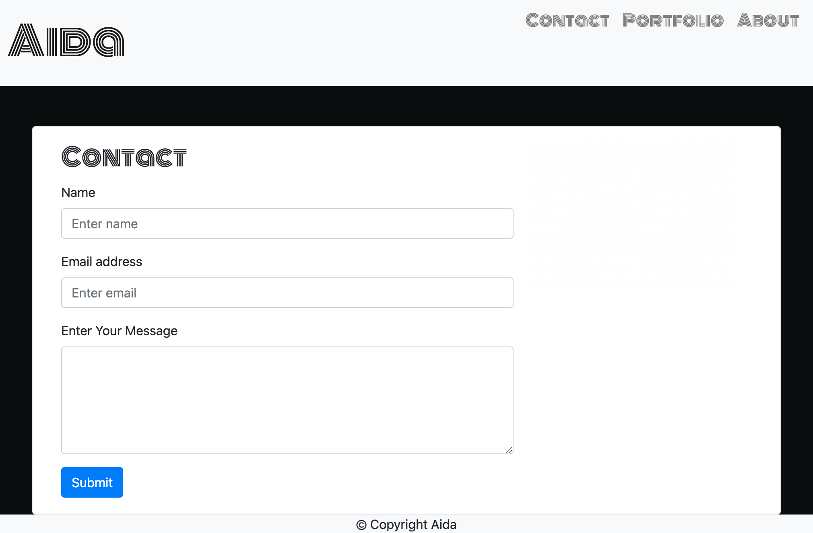

# My Portfolio
> My Portfolio made to be responsive to any device.

# Live Url
> [Aida’s Profolio](https://aidabyte.github.io/About-me-portfolio/)

## Table of contents
* [General info](#general-info)
* [Screenshots](#screenshots)
* [Setup](#setup)
* [Status](#status)
* [Inspiration](#inspiration)
* [Contact](#contact)

## General info
I created a website to serve as a portfolio for future endeavors. It is responsive and adapts to any device it is viewed on.

## Screenshots

## Setup

1. Navigate to the main page of the respository
2. Under the repository name, click Clone or download
3. In the Clone with HTTPSs section, click the copy
4. Open Terminal
5. Change the current working directory to the location where you want the cloned directory to be made.
6. Type ‘git clone’ and then paste the URL you copied
- $ git clone https://github.com/aidabyte/About-me-portfolio.git
7. Press Enter. Your local clone will be created.

## Status
Project is: _in progress_ because I am still learning and updating as I go!

## Inspiration
Visual inspiration - visuals provided from class
Bootstraps used:
Navbar - modified font and positioning in the css
Cards - modified for my contact page
Forms - modified for my contact page
W3Schools

## Contact
Created by [@aida](https://github.com/aidabyte) - feel free to contact me!
